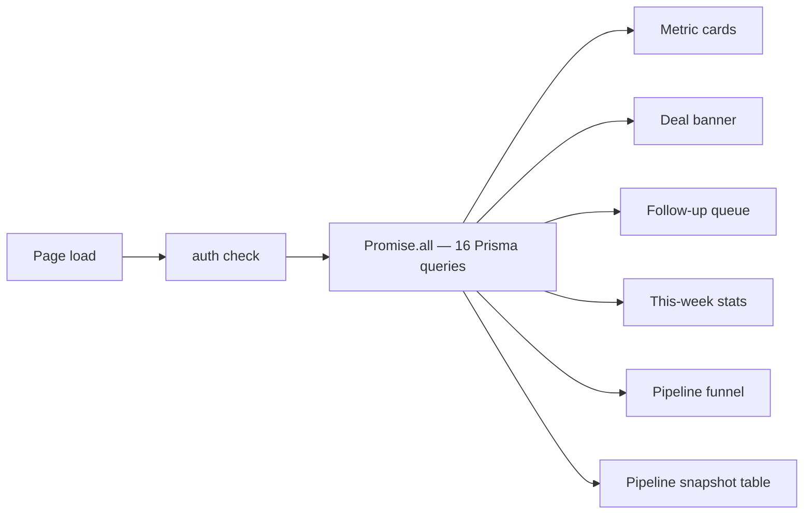
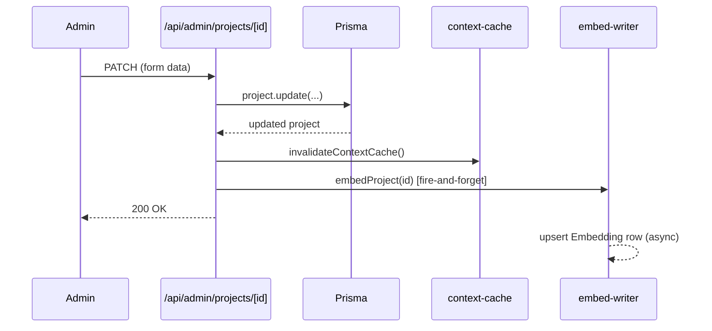

# Admin Panel

Reference for the `/admin` section of homesty.ai. Covers access control,
page inventory, the founder dashboard, mutation side-effects, and audit
logging.

---

## 1. Access Gate

**Middleware** (`src/middleware.ts`) runs on every request matching
`/admin/:path*` and `/api/admin/:path*`:

1. Reads the NextAuth JWT via `getToken`.
2. If no token → redirects to `/auth/signin`.
3. Compares `token.email.toLowerCase()` against
   `process.env.ADMIN_EMAIL?.toLowerCase()`. Case-insensitive because
   RFC 5321 allows mixed-case local-parts; mismatched casing would create
   a gap between the middleware pass and the API-route check.
4. Non-matching email → redirects to `/`.
5. For admin API mutations (POST / PUT / DELETE / PATCH on `/api/admin/*`),
   an `Origin` header is required and must appear in the allow-list
   (`homesty.ai`, `www.homesty.ai`, `buyerchat-ten.vercel.app`, or
   `NEXT_PUBLIC_APP_URL`). Missing or mismatched origin → 403.

**API-route check** — every `/api/admin/*` route handler re-verifies the
session email against `ADMIN_EMAIL` after `auth()`, so passing middleware
alone is never sufficient.

**RBAC limitation** — single-admin only. The middleware comment at
`src/middleware.ts:4` documents the upgrade path: add a `Role` field to
the `User` model and check `token.role`. All `/api/admin/*` route handlers
must be updated in tandem because they duplicate the email comparison.

---

## 2. Page Inventory

| Path | File | Purpose |
|---|---|---|
| `/admin` | `src/app/admin/page.tsx` | Immediate redirect to `/admin/overview` |
| `/admin/overview` | `src/app/admin/overview/page.tsx` | Founder dashboard (see §3) |
| `/admin/projects` | `src/app/admin/projects/page.tsx` | List and search all projects |
| `/admin/projects/new` | `src/app/admin/projects/new/` | Create a new project listing |
| `/admin/projects/[id]` | `src/app/admin/projects/[id]/` | Edit / delete a project |
| `/admin/builders` | `src/app/admin/builders/page.tsx` | List all builders |
| `/admin/builders/new` | `src/app/admin/builders/new/` | Create a new builder profile |
| `/admin/builders/[id]` | `src/app/admin/builders/[id]/` | Edit / delete a builder |
| `/admin/buyers` | `src/app/admin/buyers/page.tsx` | List all chat sessions / buyers |
| `/admin/buyers/[id]` | `src/app/admin/buyers/[id]/` | Buyer session detail and transcript |
| `/admin/followup` | `src/app/admin/followup/page.tsx` | Follow-up queue — sessions silent > 2 days |
| `/admin/intelligence` | `src/app/admin/intelligence/page.tsx` | Market intelligence and locality data |
| `/admin/revenue` | `src/app/admin/revenue/page.tsx` | Deal pipeline, commission tracking |
| `/admin/settings` | `src/app/admin/settings/page.tsx` | App configuration |
| `/admin/visits` | `src/app/admin/visits/page.tsx` | Site visit scheduling and completion |

---

## 3. Overview (Founder Dashboard)

The overview page (`src/app/admin/overview/page.tsx`) is the first screen
a founder sees after signing in. The layout (v3) flows top-to-bottom:
**greeting header** with a time-aware salutation and today's date →
**deal banner** (shown only when at least one Deal row exists, gradient
`#1F3864 → #2B4F8E`) → **5 metric cards** (active buyers, live projects,
total earned, pending visits, RERA alerts) → **2-column priority actions**
(follow-up queue on the left, system alerts on the right) → **4-stat
this-week row** (conversations, visits, qualified leads, active stages) →
**2-column pipeline section** (funnel bar chart + pipeline snapshot table).

All data is fetched in a single `Promise.all` of 16 parallel Prisma calls
wrapped in try/catch; every individual call has its own `.catch(() =>
defaultValue)` so a single slow query never zeros out the rest of the
page. The pipeline value displayed on the metric card is
`ChatSession.aggregate(_sum.buyerBudget) * 0.015` — a real budget-derived
estimate. For design-decision details, see the **Admin Overview Page**
section in `CLAUDE.md`.

The pipeline snapshot table lists only sessions in "hot" stages
(`comparison`, `visit_trigger`, `pre_visit`, `post_visit`) sorted by buyer
budget descending. Hot stage bars render in amber (`#BA7517`); earlier
stages in blue (`#185FA5`). No chart library is used — all bars are pure
Tailwind width utilities.

Data flow for the dashboard:



---

## 4. Mutations and Embeddings

Every admin save to a Project or Builder record fires two side-effects
after the Prisma commit:

1. `invalidateContextCache()` — clears the in-memory (or Upstash-backed)
   structured context so the next chat request fetches fresh data.
2. `embedProject(id)` / `embedBuilder(name)` — generates a new OpenAI
   `text-embedding-3-small` vector for the record and upserts it into the
   `Embedding` table. This call is **fire-and-forget** (`.catch` logs
   the error but does not fail the HTTP response). An OpenAI outage
   therefore never rolls back a legitimate admin save.

Affected routes:

| Route | Trigger | Embed call |
|---|---|---|
| `POST /api/admin/projects` | create | `embedProject(project.id)` |
| `PATCH /api/admin/projects/[id]` | update | `embedProject(project.id)` |
| `POST /api/admin/builders` | create | `embedBuilder(builder.builderName)` |
| `PUT /api/admin/builders/[id]` | update | `embedBuilder(builder.builderName)` |

Sequence for a project save:



For the full embedding schema and retrieval design, see
`.claude/fleet/rag-v1-design.md`.

---

## 5. Audit Log

`src/lib/audit-log.ts` exports a single function:

```ts
logAdminAction(action, entity, data, userEmail): Promise<void>
```

It writes to `prisma.auditLog` and swallows its own errors so audit
logging never breaks the main request flow.

**Covered actions** (as of this writing):

| Route file | action | entity |
|---|---|---|
| `src/app/api/admin/projects/route.ts` | `create` | `project` |
| `src/app/api/admin/projects/[id]/route.ts` | `update`, `delete` | `project` |
| `src/app/api/admin/builders/route.ts` | `create` | `builder` |
| `src/app/api/admin/builders/[id]/route.ts` | `update`, `delete` | `builder` |
| `src/app/api/admin/visits/[id]/complete/route.ts` | `complete` | `visit` |
| `src/app/api/admin/register-lead/route.ts` | `register_lead` | `visit` |
| `src/app/api/admin/market-alerts/route.ts` | `create` | `market_alert` |

**Not yet covered:** deal creation/closure, settings changes, buyer
data exports. These should be added if the app expands to multiple
admins or requires a compliance audit trail.
