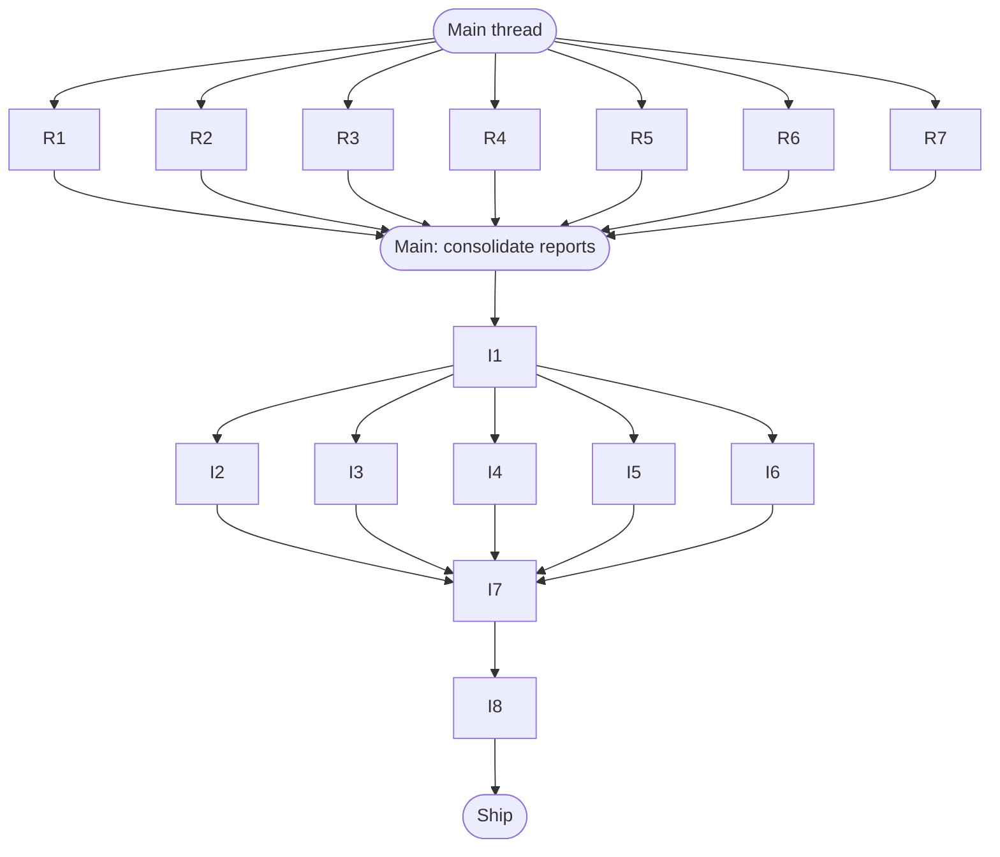

# Agent Fleet

Reference for the 15-agent Claude fleet that ships homesty.ai v1.0.
Canonical source of truth: `.claude/AGENTS.md`. This document
summarises; go there for authoritative definitions.

---

## 1. Purpose of the Fleet

The fleet exists to ship `homesty.ai` v1.0 — a Next.js 15 + Prisma 7
property-listing chat powered by GPT-4o that helps property buyers decide.
The app runs on a hard-locked stack (Next.js 15.2.9, Prisma 7, Auth.js v5
beta, Tailwind v4, Framer Motion v12, Vercel AI SDK 6, React 19,
TypeScript strict) and must be deployable to Vercel Fluid Compute on
Node.js 24. No external dependencies may be added that break those
constraints.

Agents work in two cohorts: a **research cohort** (read-only, run in
parallel) that audits and designs, and an **implementation cohort**
(writes code, runs after research lands) that applies fixes. A human
operator coordinates, commits, and runs the verification agent at the
end of each cohort.

---

## 2. Model Tiers

| Tier | Model | When to use |
|---|---|---|
| opus | Opus 4.7 | Design and architecture decisions; tasks that require reading many files and synthesizing a coherent plan |
| sonnet | Sonnet 4.6 | Focused implementation work; targeted file edits; code that must be correct on the first pass |
| haiku | Haiku 4.5 | Mechanical audits — grep-heavy work, counting, diffing; tasks that need no synthesis |

Only Anthropic models are callable from subagents. Requests for other
providers must be filed as human-side changes.

---

## 3. The 15-Agent Roster

Full definitions with scope and tier are in `.claude/AGENTS.md` section 3.

### Research cohort — read-only, run in parallel

| # | Agent | One-line description |
|---|---|---|
| R1 | backend-audit | Audits all `src/app/api/**` routes for auth gaps, missing validation, rate-limit holes, and error handling |
| R2 | frontend-audit | Audits `src/app/**` pages and `src/components/**` for a11y, performance, dark-mode, and SSR issues |
| R3 | rag-design | Produces the concrete RAG schema and retrieval code sketch per `.claude/AGENTS.md` §2 |
| R4 | system-prompt-audit | Checks `src/lib/system-prompt.ts` and `few-shot-examples.ts` for internal consistency |
| R5 | decision-engine-audit | Verifies correctness and weight sanity across `src/lib/decision-engine/**` |
| R6 | build-perf-audit | Analyses bundle report, slow routes, and cold-start triggers |
| R7 | db-query-audit | Hunts N+1s, unindexed query sites, and missing `select` narrowing |

### Implementation cohort — writes code, runs after research

| # | Agent | One-line description |
|---|---|---|
| I1 | rag-schema-migration | Adds the `Embedding` Prisma model, pgvector extension, and ivfflat index migration |
| I2 | rag-embed-writer | Creates `src/lib/rag/embed-writer.ts` and wires fire-and-forget embed hooks on admin project/builder saves |
| I3 | rag-retriever | Creates `src/lib/rag/retriever.ts` and splices retrieved chunks into `buildSystemPrompt` |
| I4 | backend-p0-fixer | Consumes R1's report and applies P0/P1 backend fixes only |
| I5 | frontend-p0-fixer | Consumes R2's report and applies P0/P1 frontend fixes only |
| I6 | decision-engine-fixer | Consumes R5's report and applies correctness fixes to the decision engine |
| I7 | doc-writer | Updates the `CLAUDE.md` backlog section to reflect post-sprint reality |
| I8 | verification-runner | Runs `npm run build`, `npx prisma validate`, and smokes `/api/chat` end-to-end |

---

## 4. Fleet Workflow

Notes:
- I2 and I3 can run in parallel but both depend on I1 (schema must land
  first).
- I4, I5, I6 can also run in parallel with I2 and I3 (disjoint scopes).
- Main thread commits between cohorts and again after I8 passes.

---

## 5. Conventions for Agents

These are contract, not suggestion. Full text in `.claude/AGENTS.md` §4.

- **Commits** — one logical change per commit. Conventional prefix
  (`feat:`, `fix:`, `perf:`, `chore:`). Body explains the *why*.
  Trailer: `Co-Authored-By: Claude <model> <noreply@anthropic.com>`.

- **File edits** — `Edit` for targeted diffs; `Write` only for brand-new
  files or full rewrites. Never touch files outside your declared scope.

- **Build verification** — an implementation agent must run `npm run build`
  before reporting complete. A broken build means keep working, not hand
  back.

- **Comments** — prefer good naming over comments. Only write a comment
  when the *why* is non-obvious. Never write task-log comments.

- **No hypothetical abstractions** — three similar lines beats a premature
  helper. Build for v1.0, not imagined v2 flexibility.

- **Scope discipline** — if a P0 in your lane requires touching a P2 beside
  it, fix both. If a P2 is outside your lane, file it in your report and
  leave the code alone.

---

## 6. Startup Protocol

Every subagent invocation must, as its **first action**:

1. Read `.claude/AGENTS.md` (this file is the fleet root source).
2. Read `CLAUDE.md` for project-specific gotchas and locked stack versions.
3. Read its own scope row in `.claude/AGENTS.md` §3 and confirm it
   understands the bounds.
4. If scope is unclear or appears to overlap another agent's row, return a
   clarification request instead of guessing.

---

## 7. When to Spin Up the Fleet

Use the fleet (rather than a single main-thread conversation) when:

- The task spans multiple disjoint modules and can be safely parallelised
  without scope overlap (e.g. frontend audit + backend audit + DB audit).
- A design phase must produce artefacts (reports, design docs) that
  implementation agents consume as inputs.
- The change is large enough that a single agent hitting context limits
  mid-task would lose coherence.

Do main-thread work for:

- Small, focused changes touching 1–3 files.
- Hot fixes where speed matters more than parallelism.
- Tasks where the scope is not yet clear enough to assign agent boundaries.

After completing work, agents return a structured report (see
`.claude/AGENTS.md` §6 for the exact format). Main thread reviews,
commits, and decides whether to promote follow-up items to the next
sprint or backlog.
