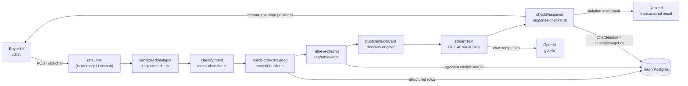
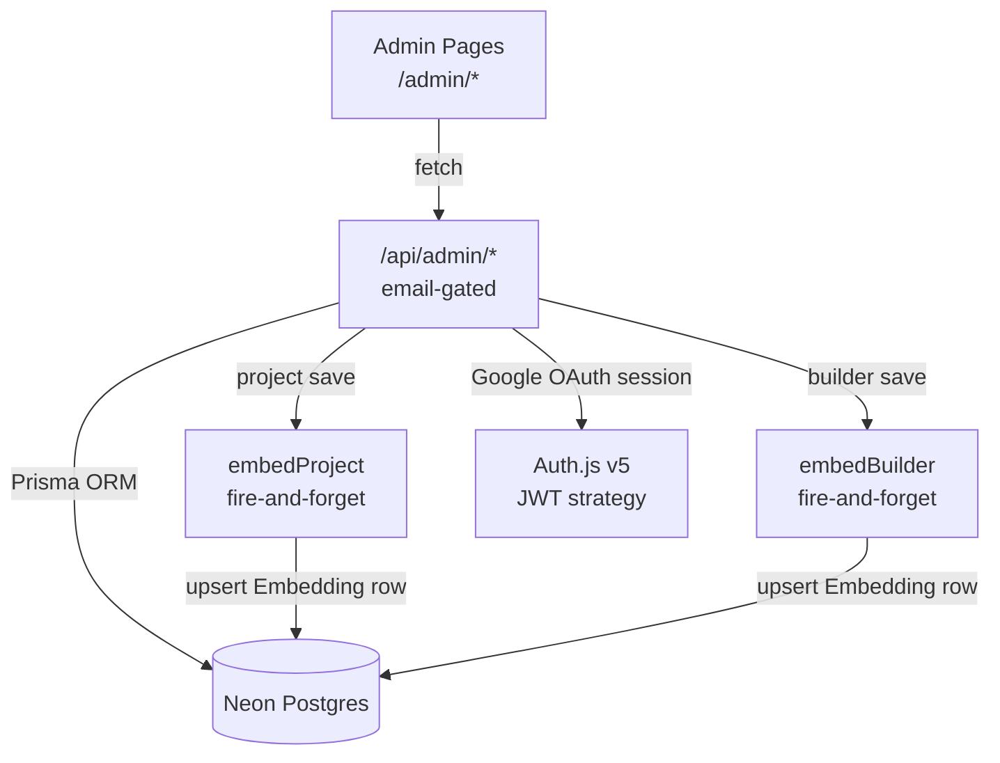

# Architecture

Homesty.ai is a property-buying copilot for Ahmedabad (South Bopal + Shela)
that lets buyers chat with a GPT-4o advisor, compare shortlisted projects, and
book site visits. The corpus is a structured Postgres dataset of projects,
builders, localities, and infrastructure, augmented by pgvector embeddings for
semantic retrieval. The core user flow is: buyer sends a message → Next.js API
route classifies intent, builds context, streams an AI response → response is
audited and the session is persisted to Neon Postgres.

For commands, environment variables, and the open-issues backlog see the root
[`CLAUDE.md`](../CLAUDE.md) and [`README.md`](../README.md).

---

## Buyer-Side Data Flow



---

## Admin-Side Data Flow



---

## Locked Stack

| Package | Locked version |
|---|---|
| `next` | `15.2.9` |
| `react` / `react-dom` | `19.2.4` |
| `prisma` / `@prisma/client` | `^7.5.0` |
| `next-auth` | `^5.0.0-beta.25` |
| `ai` (Vercel AI SDK) | `^6.0.134` |
| `@ai-sdk/openai` | `^3.0.47` |
| `tailwindcss` | `^4` |
| `framer-motion` | `^12.38.0` |
| `zod` | `^4.3.6` |
| `zustand` | `^5.0.12` |
| `typescript` | `^5` |

Do not upgrade beyond the locked major versions — see `CLAUDE.md` for rationale.

---

## Directory Map

```
buyerchat/
├── src/
│   ├── app/
│   │   ├── (public)/          # Buyer-facing pages: /, /chat, /projects, /compare
│   │   ├── admin/             # Email-gated admin pages (overview → revenue)
│   │   └── api/               # 33 route handlers
│   │       ├── chat/          # POST /api/chat — main AI pipeline entry point
│   │       ├── admin/         # Admin CRUD + intelligence + revenue routes
│   │       └── ...            # auth, projects, builders, visits, rera-fetch, etc.
│   ├── components/
│   │   ├── chat/              # ChatCenter, FloatingChatWidget, artifacts, ThemeToggle
│   │   └── admin/             # Dashboard, tables, forms, StatPill
│   └── lib/
│       ├── intent-classifier.ts   # 8 intent types
│       ├── context-builder.ts     # Structured DB context for AI prompt
│       ├── context-cache.ts       # In-memory warm cache (Redis migration pending)
│       ├── system-prompt.ts       # SOP v2.0 — core product logic
│       ├── response-checker.ts    # Post-stream hallucination / leakage gate
│       ├── sanitize.ts            # NFKC normalisation + blocklist
│       ├── rate-limit.ts          # In-memory + Upstash Redis dual backend
│       ├── decision-engine/       # score → recommend → tradeoff → risk → card
│       ├── rag/
│       │   ├── embed-writer.ts    # Upsert Embedding rows on admin save
│       │   └── retriever.ts       # pgvector cosine search at query time
│       └── types/                 # Shared TypeScript types (BuilderAIContext, etc.)
├── prisma/
│   ├── schema.prisma          # 14 models — source of truth for DB shape
│   └── migrations/            # Applied migration history
├── scripts/
│   └── embed-backfill.ts      # One-shot corpus embedding script
├── .claude/
│   ├── AGENTS.md              # 15-agent fleet spec and startup protocol
│   ├── fleet/                 # Per-topic design docs (rag-v1-design.md, etc.)
│   └── rules/                 # git-best-practices.md, full-stack-development.md
└── docs/                      # This folder — see README.md for the index
```
