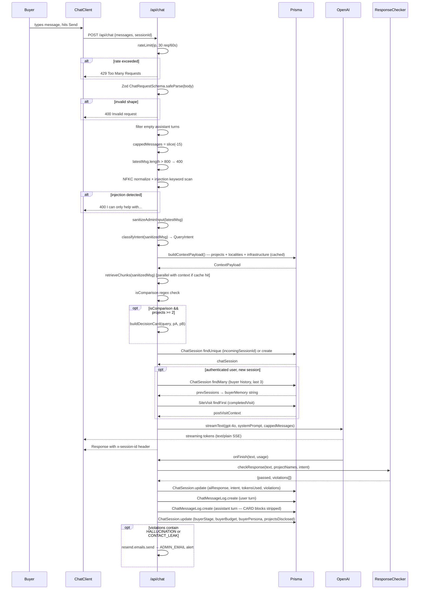

# Chat Flow — End-to-End Pipeline

**Purpose:** Documents every step that executes when a buyer sends a message to `/chat`, from HTTP receipt to streamed response and database persistence.

---

## Sequence Diagram

---

## Step-by-Step Narrative

### 1. Rate Limiting
`src/app/api/chat/route.ts:57–63`

The IP address (from `x-forwarded-for`, or `127.0.0.1` for local) is checked against an in-memory sliding-window counter: 30 requests per 60-second window. If exceeded, the request is rejected with HTTP 429 before any parsing occurs. **Known issue:** in-memory store resets on cold start (ISSUE-04 in backlog.md).

### 2. Zod Validation
`src/app/api/chat/route.ts:66–70`

The raw JSON body is parsed against `ChatRequestSchema` (lines 18–24): `messages` must be a non-empty array of up to 30 items with `role` in `{user,assistant,system}` and `content` capped at 2000 chars; `sessionId` is optional. Failures return HTTP 400 with flattened Zod errors.

### 3. History Sanitization + Length Caps
`src/app/api/chat/route.ts:73–92`

Empty assistant turns — which can occur when a prior streaming call failed client-side — are filtered out to prevent cascading empty responses (see commit `56a0bfb`). History is then sliced to the last 15 messages (VULN-06). The latest user message is then checked for length; messages over 800 characters are rejected (VULN-07).

### 4. Injection Detection
`src/app/api/chat/route.ts:94–107`

The latest message is NFKC-normalized, invisible characters stripped (`​–‍, `), and whitespace collapsed. A hardcoded 11-keyword blocklist (`INJECTION_KEYWORDS`) is tested with `includes`. Matches return HTTP 400.

### 5. Sanitize
`src/app/api/chat/route.ts:110`, `src/lib/sanitize.ts:17–24`

`sanitizeAdminInput` replaces 12 injection-pattern regexes with `[removed]` and hard-trims to 800 characters. The cleaned string (`sanitizedMsg`) is used in all downstream steps.

### 6. Intent Classification
`src/app/api/chat/route.ts:113`, `src/lib/intent-classifier.ts:11–29`

`classifyIntent(sanitizedMsg)` returns one of 8 `QueryIntent` literals using simple regex tests in priority order: `budget_query`, `location_query`, `builder_query`, `comparison_query`, `visit_query`, `legal_query`, `investment_query`, `general_query`. The intent is stored in the session and passed to `checkResponse`.

### 7. Build Context Payload
`src/app/api/chat/route.ts:116–118`, `src/lib/context-builder.ts:6–195`

`buildContextPayload()` checks in-memory cache first. On miss it fires three parallel Prisma queries (`projects`, `localities`, `infrastructure`) then appends urgency signals, filters sensitive builder fields (`contactPhone`, `contactEmail` are never selected), and bakes in a large static `locationIntelligence` string. Result is cached for subsequent requests.

### 8. Retrieve Chunks
`src/app/api/chat/route.ts:120`

`retrieveChunks(sanitizedMsg)` queries the RAG store for semantically similar knowledge chunks. Failures are silently caught (returns `[]`) so a RAG outage never blocks the chat.

### 9. Build Decision Card (conditional)
`src/app/api/chat/route.ts:122–140`

If the message matches `/compare|vs|versus|which is better|which one/i` and there are at least two projects in context, `buildDecisionCard` is called with the two most-mentioned projects (or the first two by index). Failure is caught and logged; `decisionCard` remains `null`.

### 10. Create / Find ChatSession
`src/app/api/chat/route.ts:142–156`

If `incomingSessionId` is provided, the session is looked up. Otherwise a new session is created immediately so its `id` can be returned in the response header. At this point `aiResponse` is set to empty string; it is filled in `onFinish`.

### 11. Buyer Memory + Post-Visit Context
`src/app/api/chat/route.ts:159–196`

For authenticated users starting a new session: the last 3 `ChatSession` rows are fetched to build a `buyerMemory` string. Then `SiteVisit.findFirst` checks for a completed visit needing follow-up. The winner is passed as `finalMemory` to `buildSystemPrompt`.

### 12. streamText to OpenAI
`src/app/api/chat/route.ts:198–207`

`streamText` is called with `gpt-4o`, temperature 0.3, 500-token output cap, and a 15-second abort signal. The system prompt (built by `buildSystemPrompt`) embeds the full project list, decision card, buyer memory, and retrieved chunks. The streaming response starts flowing to the client immediately; the `x-session-id` header is attached so the client can resume the session on the next message.

### 13. onFinish — Response Checker
`src/app/api/chat/route.ts:205–326`, `src/lib/response-checker.ts`

After GPT-4o finishes, `checkResponse` runs five checks (hallucination, missing CTA, contact leak, investment guarantee, out-of-area mention). Results are stored in `responsePassedChecks` and `violations` on the session. This is **audit-only** — tokens are already delivered to the client. Critical violations (`HALLUCINATION`, `CONTACT_LEAK`) trigger an email alert via Resend.

### 14. ChatSession Persist
`src/app/api/chat/route.ts:211–266`

The session row is updated with the full AI response, token count, buyer-stage detection (`detectStage`), qualification flag, budget/config/persona signals extracted from the user message, and the set of project IDs mentioned in the response (`projectsDisclosed`).

### 15. ChatMessageLog Persist
`src/app/api/chat/route.ts:227–240`

Two `ChatMessageLog` rows are created: one for the user turn (`sanitizedMsg`) and one for the assistant turn. The assistant log strips `<!--CARD:...-->` blocks before saving (these are machinery for the client artifact pipeline, not readable content).

---

## Failure Modes

| What fails | User sees | What gets logged |
|---|---|---|
| Rate limit exceeded | "Too many requests. Please wait a minute." (HTTP 429) | Nothing — rejected before any logic |
| Zod parse error | "Invalid request" + field errors (HTTP 400) | Nothing |
| Message too long | "Message too long." (HTTP 400) | Nothing |
| Injection keyword | "I can only help with South Bopal and Shela property questions." (HTTP 400) | Nothing |
| `buildContextPayload` throws | "Service temporarily unavailable." (HTTP 503) | `console.error('Context build error:', err)` |
| `retrieveChunks` throws | Silent — proceeds without RAG chunks | Swallowed (`.catch(() => [])`) |
| `buildDecisionCard` throws | Silent — proceeds without decision card | `console.error('Decision engine failed:', e)` |
| OpenAI times out (>15s) | Stream closes mid-response | `AbortSignal.timeout` terminates stream |
| `onFinish` throws | Response already sent — no user impact | `console.error('onFinish error:', err)` |
| HALLUCINATION or CONTACT_LEAK | Response already sent — no user impact | Email to ADMIN_EMAIL via Resend; violation stored on session |
| ADMIN_EMAIL not set + critical violation | Silent | `console.error` with violation list |

---

## Extension Points

**Adding a new intent:** Edit `src/lib/intent-classifier.ts` — add a new `QueryIntent` literal to the union and a regex branch in `classifyIntent`. Then update `src/lib/response-checker.ts` if the new intent has specific response rules.

**Adding a new context source:** Add a parallel Prisma query inside the `Promise.all` in `src/lib/context-builder.ts:14`. Shape the result into the `payload` object before caching. Access it in `src/lib/system-prompt.ts` via the `ctx` parameter.

**Adding a new response-checker rule:** Add a `CHECK N` block in `src/lib/response-checker.ts` — push a string to `violations` and set `passed = false` if it fires. Violations are automatically stored on the session; add a `isCritical` condition in `src/app/api/chat/route.ts:303` to trigger email alerts.

**Switching to streaming response validation:** The current checker is post-stream and audit-only. To block mid-stream, integrate into Vercel AI SDK `onChunk` callback in `src/app/api/chat/route.ts:198`.
