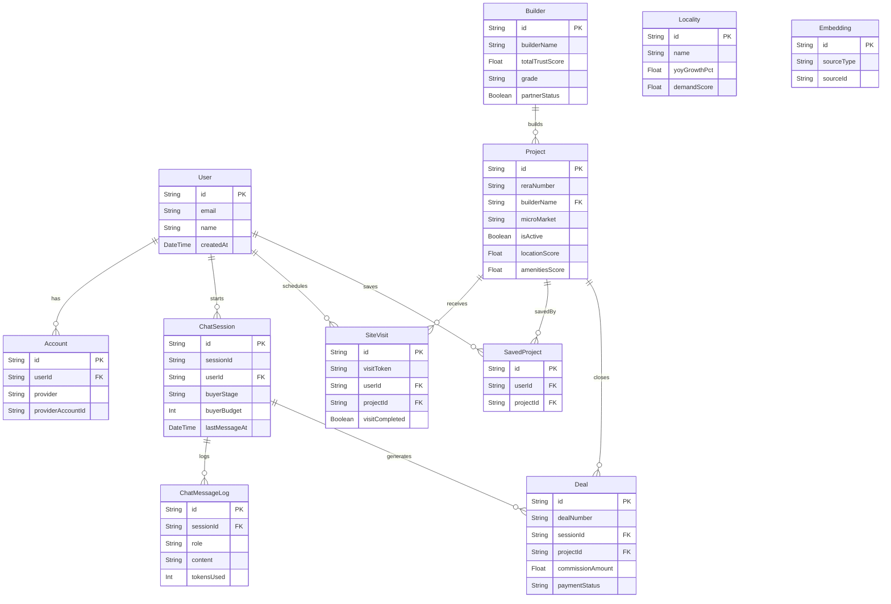

# Database Reference

## 1. Overview

The application uses **Neon serverless Postgres** accessed through the **Prisma 7** client
with the `@prisma/adapter-neon` adapter (`prisma.config.ts`). The schema contains
**18 models** (not 26 — see `prisma/schema.prisma` directly for the canonical count).
There are no explicit `deletedAt` soft-delete columns; soft deletion is implemented
behaviourally: `Project.isActive = false` is set on admin "delete" instead of a hard
`prisma.project.delete()` call (`src/app/api/admin/projects/[id]/route.ts:157`).
All other delete semantics are enforced via Prisma `onDelete` policies (Cascade,
Restrict, or SetNull) documented in section 5.

---

## 2. ER Diagram (10 core entities)



---

## 3. Model Reference

### 3.1 Domain

#### Project
Stores every real-estate listing. Carries five score fields (`locationScore`,
`amenitiesScore`, `infrastructureScore`, `demandScore`, `builderGradeScore`) all
defaulting to 50, plus SOP planning/growth/total floats for the decision engine.
The `isActive` flag is the soft-delete sentinel. Relation to `Builder` is via the
denormalised `builderName` string (not FK id) — `onDelete: Restrict` prevents orphan
projects if a builder is removed while projects exist.

Key relations: `Builder` (Restrict), `PriceHistory[]` (Cascade), `SiteVisit[]`
(Cascade), `Deal[]` (SetNull), `SavedProject[]` (Cascade).

Notable indexes: `@@index([microMarket])`, `@@index([isActive])`,
`@@index([decisionTag])`, `@@index([constructionStatus])`, `@@index([builderName])`.

#### Builder
Developer profile. Sensitive commercial fields (`contactPhone`, `contactEmail`,
`commissionRatePct`, `partnerStatus`) exist in the database but are excluded from AI
context at compile time via `BuilderAIContext` type
(`src/lib/types/builder-ai-context.ts`). `totalTrustScore` is a derived sum of the
five sub-scores; `grade` is computed by `src/lib/grade.ts`.

No child-relation `onDelete` policy is needed — Builder is the top-level aggregate.
Deletion is blocked by `Project.onDelete: Restrict`.

#### Locality
Read-only reference data for market context: YoY growth %, demand score, average price
per sqft. No FK relations — used directly in AI context via `context-builder.ts`.

#### Infrastructure
Catalogue of nearby infrastructure items (metro, hospital, etc.) with a
`priceImpactPct` float. No FK relations. `name` is unique.

#### Amenity
Geo-tagged amenity records. Unique on `(name, latitude, longitude)`. No FK relations.

---

### 3.2 Transactional

#### ChatSession
One logical conversation. `sessionId` is the client-side UUID; `id` is the DB PK.
Tracks buyer journey fields (`buyerStage`, `buyerPersona`, `buyerBudget`,
`qualificationDone`). `lastMessageAt` auto-updates via `@updatedAt` — used by the
admin follow-up queue (sessions where `lastMessageAt < 2 days ago`).

Key relations: `User?` (Cascade, nullable for anonymous visitors),
`ChatMessageLog[]` (Cascade), `Deal[]` (SetNull).

Indexes: `@@index([userId])`, `@@index([buyerStage])`, `@@index([lastMessageAt])`,
`@@index([createdAt])`.

#### ChatMessageLog
Per-message audit trail. `role` is `"user"` or `"assistant"`. `violations[]` stores
response-checker findings. `onDelete: Cascade` from `ChatSession` — log rows are
deleted when the parent session is deleted.

Index: `@@index([sessionId])`.

#### Deal
Commission record. Both `sessionId` and `projectId` are nullable with `onDelete:
SetNull` — a deal record survives even if the chat session or project is deleted.
`dealNumber` is a unique business key. `paymentStatus` defaults to `"pending"`.

Indexes: `@@index([createdAt])`, `@@index([projectId])`, `@@index([sessionId])`,
`@@index([paymentStatus])`.

#### SiteVisit
Scheduled property visit. `visitToken` is the unique OTP-verification token sent to
the buyer. `expiresAt` allows token expiry. `onDelete: Cascade` from both `User` and
`Project` — visits are cleaned up when either side is deleted.

Indexes: `@@index([userId])`, `@@index([projectId])`, `@@index([visitCompleted])`,
`@@index([expiresAt])`.

#### SavedProject
Join table for user wishlist. Unique on `(userId, projectId)`. `onDelete: Cascade`
from both `User` and `Project`.

Index: `@@index([projectId])`.

#### MarketAlert
Standalone notification record. No FK relations. `isRead` boolean for inbox state.

---

### 3.3 Auth

#### User
Central identity record. Created/updated on every Google OAuth sign-in via the
`signIn` callback in `src/lib/auth.ts:26`. If the upsert fails the sign-in is denied
(returns `false`).

#### Account
NextAuth OAuth account link. `onDelete: Cascade` from `User`. Unique on
`(provider, providerAccountId)`.

#### Session
NextAuth database session record. `onDelete: Cascade` from `User`. In practice JWT
strategy is used (`src/lib/auth.ts:21`) so this table is largely unused.

---

### 3.4 Ops

#### AuditLog
Append-only admin action log. Written by `src/lib/audit-log.ts` on every admin
create/update/delete. No FK constraints — `entityId` is a plain string so the row
survives if the entity is later deleted.

Indexes: `@@index([action])`, `@@index([entity])`, `@@index([userEmail])`,
`@@index([createdAt])`.

#### BuyerDemand
Weekly demand snapshot (`weekOf`, `inquiryCount`). Used for AI market context. No FK
relations.

#### Embedding
Vector store for RAG. `embedding` field uses `Unsupported("vector(1536)")` — requires
the `pgvector` Postgres extension. Unique on `(sourceType, sourceId)`.

Index: `@@index([sourceType, sourceId])`.

---

## 4. Indexes

| Index | Model | Supported query |
|---|---|---|
| `@@index([microMarket])` | Project | Filter projects by locality |
| `@@index([isActive])` | Project | Exclude soft-deleted listings |
| `@@index([decisionTag])` | Project | Filter by Strong Buy / Avoid etc. |
| `@@index([constructionStatus])` | Project | Filter ready-to-move vs. under-construction |
| `@@index([builderName])` | Project | Join projects to builder by name |
| `@@index([projectId])` | PriceHistory | Fetch price history for a project |
| `@@index([userId])` | SiteVisit | All visits by a user |
| `@@index([projectId])` | SiteVisit | All visits to a project |
| `@@index([visitCompleted])` | SiteVisit | Filter pending vs. completed visits |
| `@@index([expiresAt])` | SiteVisit | Token expiry sweep |
| `@@index([userId])` | ChatSession | Sessions by user |
| `@@index([buyerStage])` | ChatSession | Pipeline funnel grouping |
| `@@index([lastMessageAt])` | ChatSession | Follow-up queue (idle sessions) |
| `@@index([createdAt])` | ChatSession | This-week activity |
| `@@index([sessionId])` | ChatMessageLog | All messages in a session |
| `@@index([userId])` | SavedProject | Wishlist by user |
| `@@index([projectId])` | SavedProject | All saves for a project |
| `@@index([createdAt])` | Deal | Revenue by date |
| `@@index([projectId])` | Deal | Deals per project |
| `@@index([sessionId])` | Deal | Deal originating from a session |
| `@@index([paymentStatus])` | Deal | Pending payment queue |
| `@@index([action])` | AuditLog | Filter audit log by action type |
| `@@index([entity])` | AuditLog | Filter audit log by entity type |
| `@@index([userEmail])` | AuditLog | All actions by an admin |
| `@@index([createdAt])` | AuditLog | Chronological audit trail |
| `@@index([sourceType, sourceId])` | Embedding | RAG lookup by source |

---

## 5. onDelete Matrix

| Relation (child → parent) | Policy | Rationale |
|---|---|---|
| Account → User | Cascade | OAuth tokens are meaningless without the user |
| Session → User | Cascade | JWT sessions are user-scoped |
| ChatSession → User | Cascade | Session data owned by user |
| ChatMessageLog → ChatSession | Cascade | Log rows have no standalone value |
| SiteVisit → User | Cascade | Visit is user-scoped |
| SiteVisit → Project | Cascade | Visit is project-scoped; project deletion is rare and intentional |
| SavedProject → User | Cascade | Wishlist is user-owned |
| SavedProject → Project | Cascade | Wishlist entry becomes meaningless without the project |
| PriceHistory → Project | Cascade | Price history has no meaning without the project |
| Deal → ChatSession | SetNull | Deal record must survive for revenue accounting even if session is purged |
| Deal → Project | SetNull | Deal must survive even if the project listing is removed |
| Project → Builder | Restrict | Prevents accidental builder deletion while live projects exist (ISSUE-57) |

---

## 6. Migration Discipline

**Standard workflow:**

```bash
# 1. Edit prisma/schema.prisma
# 2. Generate a named migration without applying it for review
npx prisma migrate dev --create-only --name descriptive_name
# 3. Review the generated SQL in prisma/migrations/<timestamp>_descriptive_name/migration.sql
# 4. Apply
npx prisma migrate dev
# 5. Regenerate the Prisma client
npx prisma generate
```

**Use `--create-only`** whenever the migration touches production data (column drops,
type changes, adding `NOT NULL` to populated tables) so the SQL can be reviewed before
execution.

**Leading example — Embedding table / pgvector:**
The `Embedding` model uses `Unsupported("vector(1536)")` which requires the
`pgvector` Postgres extension. Before the migration can be applied on Neon, the
extension must be enabled:

```sql
CREATE EXTENSION IF NOT EXISTS vector;
```

This must be added manually to the migration SQL generated by Prisma (Prisma does not
emit `CREATE EXTENSION` statements). The migration is currently unapplied in
environments where `pgvector` is not yet enabled — running `prisma migrate dev`
without the extension will fail with a Postgres error on the `vector` type.
