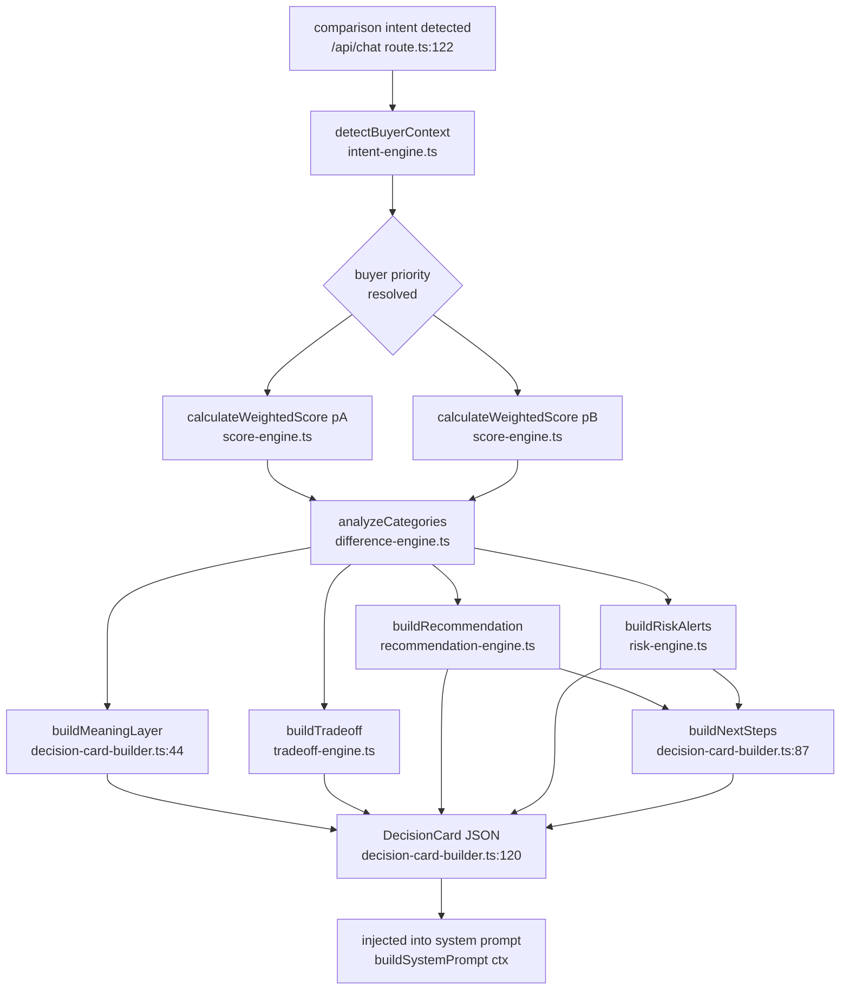

# Decision Engine — Pipeline Reference

Documents the 5-engine pipeline that builds a `DecisionCard` for comparison queries.

---

## When It Runs

The decision engine is gated by two conditions in `src/app/api/chat/route.ts:122–140`:

1. The sanitized user message matches `/compare|vs|versus|which is better|which one/i`
2. `context.projects.length >= 2`

When both are true, `buildDecisionCard` is called with the two most-mentioned projects in the message + conversation history (falling back to `projects[0]` and `projects[1]`). If the resolved project IDs are identical the card is skipped. The resulting `DecisionCard` JSON is injected into the system prompt and surfaced as an artifact card in the UI.

---

## Flowchart

---

## Per-Engine Reference

### score-engine — `src/lib/decision-engine/score-engine.ts`

**Purpose:** Converts raw `CategoryScores` into a single weighted total, adjusted by buyer priority.

**Key types/functions:**
- `CategoryScores` — five fields: `location`, `amenities`, `builderTrust`, `infrastructure`, `demand`, each 0–100.
- `BuyerPriority` — 6 values: `family | lifestyle | investor | risk_averse | rental | balanced`.
- `calculateWeightedScore(scores, priority)` → `WeightedScore { total, breakdown, priority }`.
- `safeScore(n)` — internal guard: coerces non-finite / out-of-range values to 50 (neutral mid-scale).

**Invariants:**
- Every `PRIORITY_WEIGHTS` row sums to exactly 1.0 (verified by `score-engine.test.ts:28`).
- `total` is always a finite integer in `[0, 100]` even if input contains `undefined`, `NaN`, or `Infinity`.
- `balanced` priority uses `BASE_WEIGHTS`: location 0.25, amenities 0.20, builderTrust 0.25, infrastructure 0.15, demand 0.15.
- `risk_averse` gives builderTrust weight 0.40 — the heaviest single-category weight in the system.

---

### difference-engine — `src/lib/decision-engine/difference-engine.ts`

**Purpose:** Identifies which project wins each category and classifies the gap magnitude.

**Key types/functions:**
- `CategoryDiff` — per-category struct: `{ category, scoreA, scoreB, diff (A−B), winner, significance }`.
- `DifferenceAnalysis` — `{ diffs[], categoryWinners, aStrengths[], bStrengths[] }`.
- `analyzeCategories(scoresA, scoresB)` → `DifferenceAnalysis`.
- `getSignificance(diff)` — thresholds: ≤4 → `ignore`, ≤9 → `mention_lightly`, ≤14 → `meaningful`, >14 → `strong`.

**Invariants:**
- `winner = 'tie'` when `|diff| ≤ 4`, regardless of sign.
- `aStrengths` / `bStrengths` include only diffs classified `meaningful` or `strong`.
- Categories are sorted alphabetically before iteration (stable ordering for deterministic output).

---

### intent-engine — `src/lib/decision-engine/intent-engine.ts`

**Purpose:** Detects buyer persona and priority from the comparison query. Extends `src/lib/intent-classifier.ts` without replacing it — this engine operates on the full query string, not just the intent label.

**Key types/functions:**
- `BuyerContext` — 8 boolean flags (`familyFocus`, `investorFocus`, `riskAverse`, `budgetSensitive`, `urgencyHigh`, …) + `priority: BuyerPriority` + `intentSignals: string[]`.
- `detectBuyerContext(query)` → `BuyerContext`.
- Priority resolution order: `risk_averse` > `family` > `investor` > `lifestyle` > `balanced`.

**Invariants:**
- `inferredOnly = true` when no signal arrays matched (i.e., `intentSignals.length === 0`).
- Only one `priority` value is assigned; co-occurring signals follow the priority-resolution order above.

---

### recommendation-engine — `src/lib/decision-engine/recommendation-engine.ts`

**Purpose:** Generates conditional recommendations. Never declares one universal winner — always expresses choices as "if X, pick A; if Y, pick B."

**Key types/functions:**
- `Recommendation` — `{ conditions[], overallDirection, confidence, confidenceReason }`.
- `buildRecommendation(context, scoreA, scoreB, diffs, nameA, nameB)` → `Recommendation`.
- `getConfidenceLevel(scoreA, scoreB, diffs, context)` → `{ level: 'high'|'moderate'|'low', reason }`.

**Invariants:**
- `conditions` list always has at most one priority-override entry prepended (for `risk_averse`, `family`, `investor`).
- `overallDirection` never uses the word "best" — language is deliberately hedged.
- `confidence = 'high'` requires: score gap > 8 AND a `strong` diff AND `intentSignals.length > 0`.

---

### risk-engine — `src/lib/decision-engine/risk-engine.ts`

**Purpose:** Emits `RiskAlert` objects from weak category scores, buyer context flags, and possession timelines.

**Key types/functions:**
- `RiskAlert` — `{ level: 'high'|'medium'|'low', message }`.
- `buildRiskAlerts(scoresA, scoresB, diffs, context, nameA, nameB, possessionMonthsA?, possessionMonthsB?)` → `RiskAlert[]`.

**Invariants:**
- A `high` alert fires for any project whose `builderTrust < 50`.
- The risk-averse safety alert names the **trust-winner** as the safer pick and names the **trust-loser** as the alternative — direction is derived from `diffs.categoryWinners.builderTrust`, not hardcoded A/B (fixed in commit `29c0fdc`).
- A Jantri cost note (level `low`) is always appended unconditionally — it is hyperlocal and always relevant in Ahmedabad.
- Possession alerts fire only when `possessionMonths > 24` AND `context.urgencyHigh`.

---

### tradeoff-engine — `src/lib/decision-engine/tradeoff-engine.ts`

**Purpose:** Generates a one-line trade-off headline and statement summarising the most important difference.

**Key types/functions:**
- `TradeOff` — `{ headline, statement }`.
- `buildTradeoff(diffs, context, nameA, nameB)` → `TradeOff`.
- Uses `diffs.aStrengths[0]` and `diffs.bStrengths[0]` (top `meaningful+` diff per side).

**Invariants:**
- Falls back to `"Very close call"` when neither side has any `meaningful+` strength.
- `CATEGORY_LABELS` maps internal category keys to human-readable labels for the statement text.

---

### decision-card-builder — `src/lib/decision-engine/decision-card-builder.ts`

**Purpose:** Orchestrator — calls all engines in sequence and assembles the final `DecisionCard` JSON.

**Key types/functions:**
- `ProjectInput` — minimal project shape consumed by the engine (scores, possession, price, RERA).
- `DecisionCard` — the full output: `{ buyerContext, projectA, projectB, categoryWinners, meaningLayer, tradeoff, recommendation, riskAlerts, nextSteps, generatedAt }`.
- `buildDecisionCard(query, projectA, projectB)` → `DecisionCard`.
- `buildMeaningLayer` (line 44) — translates top diffs into buyer-readable consequence statements; max 3.
- `buildNextSteps` (line 87) — uses `recommendation.conditions[0]?.project` to pick the recommended-first visit project, with score-total fallback when `conditions` is empty.

**Invariants:**
- `nextSteps` is always capped at 3 items.
- `generatedAt` is an ISO 8601 timestamp set at call time (deterministic within a single request).
- `getMonthsUntilPossession` (line 38) can return a **negative** value when possession is already overdue — the risk-engine does not flag this case yet (see Known Gaps below).

---

## Correctness Invariants (R5 Audit)

These five invariants were identified in the R5 audit report and are enforced or verified by the test suite:

| # | Invariant | Where verified |
|---|---|---|
| 1 | **Weights sum to 1.0** — every `PRIORITY_WEIGHTS` row produces `total = 100` for all-100 scores | `score-engine.test.ts:28` — "every priority row sums weights to 1.0" |
| 2 | **No NaN propagation** — `undefined`, `null`, `NaN`, `Infinity` inputs are coerced to 50 by `safeScore` | `score-engine.test.ts:39–57` — null/undefined/degenerate-row cases |
| 3 | **Deterministic conditions** — category sort in `analyzeCategories` is alphabetical; given identical inputs, output is identical across calls | `src/lib/decision-engine/difference-engine.ts:38` (`Object.keys(...).sort()`) |
| 4 | **Score-derived winner** — when `recommendation.conditions` is empty, `buildNextSteps` falls back to `scoreATotal >= scoreBTotal` rather than silently defaulting to B | `src/lib/decision-engine/decision-card-builder.ts:100–103` |
| 5 | **A/B direction** — risk-averse alert names the trust-winner correctly regardless of whether it is A or B | `risk-engine.test.ts:40–64` — "when B wins builder trust…" / "when A wins builder trust…" |

Test files:
- `src/lib/decision-engine/score-engine.test.ts`
- `src/lib/decision-engine/risk-engine.test.ts`

---

## Known Gaps

**Past-possession risk (v1.1):** `getMonthsUntilPossession` in `decision-card-builder.ts:38` returns a negative number when `possessionDate` is already in the past, but `buildRiskAlerts` only checks `possessionMonths > 24`. A project that is already overdue gets no possession alert. This is flagged as a v1.1 fix.

**13 prompt rules unvalidated by response-checker:** `src/lib/system-prompt.ts` encodes behavioural rules (language matching, 6-layer disclosure protocol, no-guarantee language, etc.) that are enforced by GPT-4o following the prompt — but `checkResponse` only validates 5 of them programmatically. The remaining 13 rules have no automated post-stream verification. Cross-reference: [../docs/security.md](./security.md) (pending creation).
