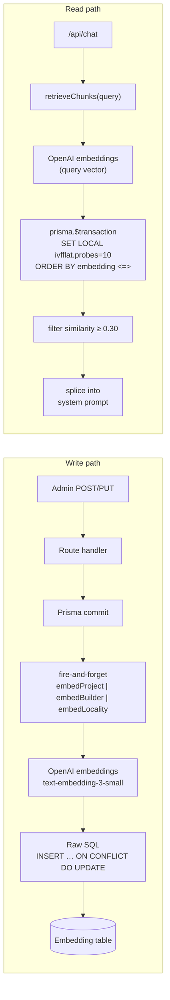
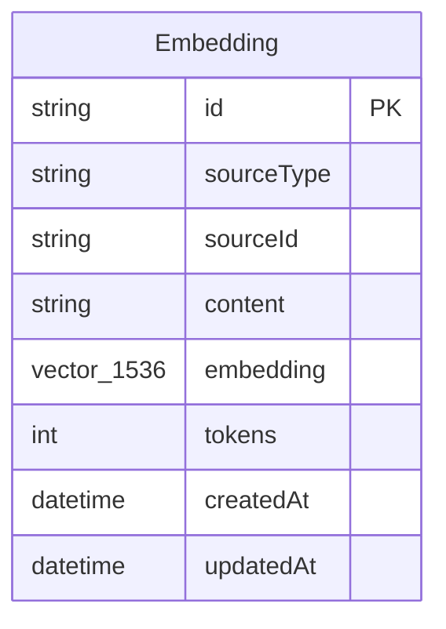

# RAG System — v1 Reference

## 1. Overview

The RAG system augments the AaiGhar chat assistant with retrieval-augmented context drawn from the live property corpus. Embeddings are stored as 1536-dimensional vectors in Neon Postgres via the `pgvector` extension, generated by OpenAI's `text-embedding-3-small` model. An `ivfflat` cosine index (lists = 100) enables sub-second approximate nearest-neighbour search. At query time the top-K chunks whose cosine similarity meets the 0.30 threshold are injected into the system prompt, giving GPT-4o access to facts beyond its training data without any external vector database.

---

## 2. System Diagram



---

## 3. Corpus and Chunking

One chunk per source row. All chunks fit well under the 8 191-token model cap; no overlap or multi-chunk splitting is needed.

| sourceType | Fields concatenated into prose | Target tokens | Sensitive fields excluded |
|---|---|---|---|
| `project` | projectName, builderName, microMarket, configurations, priceRange, possessionDate, amenities, honestConcern, analystNote, priceNote, decisionTag | 200–400 | none |
| `builder` | brandName, grade, totalTrustScore, deliveryScore, reraScore, qualityScore, financialScore, responsivenessScore | 120–250 | contactPhone, contactEmail, commissionRatePct, partnerStatus |
| `locality` | name, yoyGrowthPct, demandScore, avgPricePerSqft | 200–350 | none |
| `infra` | name, type, priceImpactPct, sourceUrl | 40–80 | none |
| `faq` | question + answer | 100–400 | — (table ready; no admin UI in v1, skipped in I2) |

Chunk text is plain prose, not JSON — prose embeds more accurately than serialised key-value pairs.

Template functions (all in `src/lib/rag/embed-writer.ts`):

- `chunkForProject` — `src/lib/rag/embed-writer.ts:17`
- `chunkForBuilder` — `src/lib/rag/embed-writer.ts:46`
- `chunkForLocality` — `src/lib/rag/embed-writer.ts:63`
- `chunkForInfra` — `src/lib/rag/embed-writer.ts:76`

`chunkForBuilder` accepts a `BuilderAIContext` argument (`src/lib/types/builder-ai-context.ts`), which is a compile-time guard: the type physically cannot carry the four sensitive fields.

---

## 4. Data Model

### Prisma schema

```prisma
model Embedding {
  id         String   @id @default(cuid())
  sourceType String
  sourceId   String
  content    String   @db.Text
  embedding  Unsupported("vector(1536)")
  tokens     Int
  createdAt  DateTime @default(now())
  updatedAt  DateTime @updatedAt

  @@unique([sourceType, sourceId])
  @@index([sourceType, sourceId])
}
```

Key design decisions:

- **`@@unique([sourceType, sourceId])`** is the idempotency key. The SQL constraint is named `Embedding_sourceType_sourceId_key` (Prisma-generated). The `ON CONFLICT` clause in `upsertEmbedding` references this name implicitly via the column list. Re-saving any source row updates the existing embedding; it never appends a duplicate.
- **`Unsupported("vector(1536)")`** — Prisma 7 has no native pgvector type. The `Unsupported` escape hatch tells the Prisma client to skip the field for typed queries while still emitting the correct column in the `CREATE TABLE`. All vector reads and writes go through `prisma.$executeRaw` / `prisma.$queryRawUnsafe`.
- **ivfflat index** (`embedding_vec_idx`) uses `lists = 100`, calibrated for ~5 k chunks (sqrt(5000) ≈ 71, rounded up for headroom). Revisit when corpus crosses 20 k rows. Migration SQL: `prisma/migrations/20260421000000_add_rag_embeddings/migration.sql`.
- Retrieval quality tuning is applied at query time: `SET LOCAL ivfflat.probes = 10` inside a `prisma.$transaction` — this narrows the search to the 10 most promising ivfflat cells per query.

### ER diagram



---

## 5. Operating the System

Steps to go live on a fresh environment or after a schema drift:

1. **Resolve schema drift** — run `npx prisma validate` and ensure `prisma/schema.prisma` contains the `Embedding` model exactly as shown in §4.
2. **Apply the migration** — `npx prisma migrate dev`. This runs `prisma/migrations/20260421000000_add_rag_embeddings/migration.sql`, enabling the `vector` extension and creating the table plus all three indexes.
3. **Dry-run the backfill** — `npm run embed:backfill -- --dry`. The script counts every project, builder, locality, and infrastructure row, tallies token estimates, and prints the projected OpenAI cost without making any API calls or DB writes. Verify the numbers are plausible before proceeding.
4. **Run the live backfill** — `npm run embed:backfill`. Embeds all rows in batches of 50, then runs `ANALYZE "Embedding"` so the query planner has accurate statistics for the ivfflat index.
5. **Deploy** — the retriever is already wired into `/api/chat`. No further configuration is required; the system degrades gracefully (returns `[]`) if the embedding table is absent or OpenAI is unreachable.

The backfill is idempotent. Rerunning it after adding new projects or builders is safe — existing rows are updated in place via the upsert.

---

## 6. Cost and Performance

| Dimension | Value | Notes |
|---|---|---|
| Retrieval timeout | 600 ms | Hard ceiling via `Promise.race`; returns `[]` on expiry |
| Similarity threshold | ≥ 0.30 cosine | Rows below this are dropped as noise after the DB query |
| Fallback on any failure | `[]` | `retrieveChunks` catches all errors and timeout races; chat is never blocked |
| Full backfill cost | ~$0.0005 | ~25 k tokens × $0.02/1 M |
| Monthly query cost | ~$0.016 | 10 k queries/month × ~80 tokens/query |
| **Total monthly cost** | **< $0.05** | Cited from design doc §6; no budget gate needed |

The cost figures are derived from `text-embedding-3-small` pricing ($0.02 per 1 M tokens) applied to the corpus and query-volume estimates in `.claude/fleet/rag-v1-design.md §6`.

---

## 7. What v1 Does NOT Do

The following are explicit non-goals for this release:

1. **No chat-history RAG** — conversation memory is carried in `ChatSession` fields (`buyerStage`, `buyerPersona`, etc.), not re-embedded.
2. **No HyDE, multi-vector embeddings, or re-ranking** — straight nearest-neighbour with a similarity floor is sufficient at current corpus size.
3. **No external vector database** — Neon pgvector keeps the stack simple; Pinecone, Upstash Vector, and Weaviate are not used.
4. **No async queue for embedding writes** — admin saves are infrequent; the synchronous fire-and-forget pattern (with `try/catch` so OpenAI errors never fail a save) is adequate.
5. **No per-sourceType filtering in the retriever** — top-K across the whole corpus is fine at 5 k rows. Revisit at 50 k.

---

## 8. Troubleshooting

| Symptom | Likely cause | Fix |
|---|---|---|
| `retrieveChunks` always returns `[]` | Migration not applied; `"Embedding"` table does not exist | Run `npx prisma migrate dev` and confirm the table appears in `npx prisma studio` |
| `upsertEmbedding` fails with unique-constraint error | The `ON CONFLICT` column list does not match the actual constraint name | Verify the constraint is named `Embedding_sourceType_sourceId_key` in the DB; run `\d "Embedding"` in psql or check the migration SQL |
| Slow retrieval (> 600 ms, frequent timeouts) | ivfflat index needs statistics refresh, or `lists`/`probes` are mismatched for corpus size | Run `ANALYZE "Embedding";` in psql; consider increasing `lists` (schema change + reindex) or `probes` (query-time, edit `retriever.ts:33`) |
| Sensitive builder field appears in a retrieved chunk | `chunkForBuilder` received a field outside `BuilderAIContext`, or the type was widened | Audit `src/lib/types/builder-ai-context.ts`; ensure `contactPhone`, `contactEmail`, `commissionRatePct`, `partnerStatus` are absent from the type; check the Prisma `select` in `embed-writer.ts:156` |
